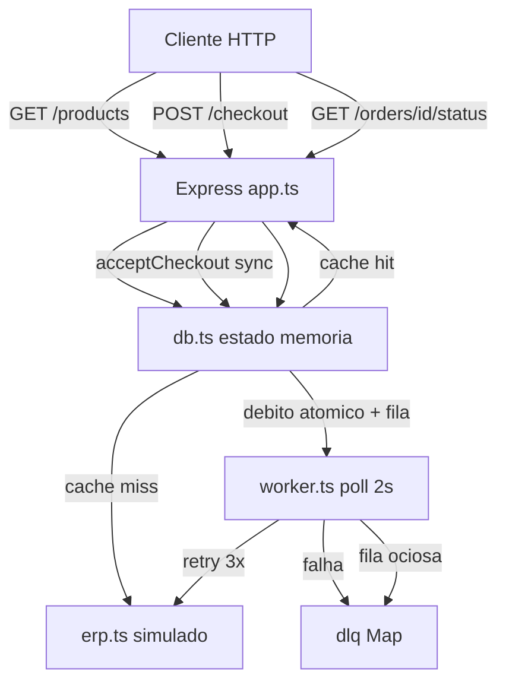

# PROMPTS.md — CaseCellShop

Você vai implementar o backend da **CaseCellShop**, uma loja de capinhas em hipercrescimento. O objetivo é demonstrar fundamentos de **cache**, **observabilidade**, **concorrência** e **resiliência** com Node.js, TypeScript e estado 100% em memória.

Este não é um e-commerce completo. Não implemente autenticação, pagamento real, front-end, deploy ou integração real com ERP. O ERP é legado, crítico para a empresa e **não pode ser alterado** — simule-o em código.

---

## Stack e restrições

- **Runtime:** Node.js >= 18
- **Linguagem:** TypeScript (strict)
- **HTTP:** Express — única dependência de runtime
- **Tooling:** tsx, typescript, @types/node, @types/express
- **Testes:** node:test + node:assert (nativos)
- **Estado:** Map, Set e Array em memória — sem Redis, MySQL, Postgres, RabbitMQ ou Kafka
- **Módulos nativos permitidos:** crypto (UUID), node:test, node:assert

Scripts necessários no package.json:
- dev → sobe a API com tsx
- test → executa a suíte com tsx --test
- typecheck → tsc --noEmit

Configuração TypeScript: target ES2022, module ESNext, moduleResolution Bundler, strict true, noEmit true, include apenas src.

---

## Estrutura do projeto

Organize o repositório assim:

```text
/
├── .gitignore          (node_modules, logs, dist, editores, artefatos internos)
├── package.json
├── tsconfig.json
├── openapi.yaml        (contrato OpenAPI 3.0.3 das 3 rotas)
├── README.md           (guia de execução, decisões, SLO, alertas, runbook)
├── RESPOSTAS.md        (respostas conceituais às 5 perguntas do desafio)
├── PROMPTS.md          (este registro de uso de IA)
└── src/
    ├── observability.ts
    ├── erp.ts
    ├── db.ts
    ├── worker.ts
    ├── app.ts
    ├── server.ts
    └── test.ts
```

---

## Arquitetura



A API e o worker rodam no **mesmo processo**. O worker usa setInterval. A API escuta na porta **3000**.

---

## Rotas HTTP (obrigatórias)

### GET /products

Retorna o catálogo de produtos com cache TTL, prevenção de cache stampede e fallback para dado stale.

- **200:** array de Product `{ id, name, price, stock }`
- **503:** `{ error: "ERP indisponível" }` — quando ERP falha e não há cache stale

Headers de resposta: ecoar `X-Correlation-Id` e incluir `X-Request-Id` único por requisição.

### POST /checkout

Inicia checkout assíncrono. **Não aguarda** o ERP. Retorna imediatamente.

- Header obrigatório: `Idempotency-Key`
- Body: `{ productId: string, quantity: integer >= 1 }`
- **202:** `{ orderId, status }` — status inicial `PENDING`; replay idempotente retorna o mesmo orderId e o status **atual**
- **400:** payload inválido, produto não encontrado ou estoque insuficiente

Mensagens de erro exatas:
- `"Payload ou Idempotency-Key inválido"`
- `"Produto não encontrado"`
- `"Estoque insuficiente"`

### GET /orders/{orderId}/status

- **200:** `{ id, status }` onde status ∈ `PENDING | SUCCESS | FAILED`
- **404:** `{ error: "Pedido não encontrado" }`

---

## Constantes do sistema

| Constante | Valor |
|---|---|
| TTL do cache | 5000 ms |
| Intervalo do worker | 2000 ms |
| Snapshot de métricas | 10000 ms |
| Latência simulada ERP (fetch) | 200 ms |
| Latência simulada ERP (faturamento) | 300 ms |
| Taxa de sucesso ERP (modo default) | 80% |
| Máximo de retries no worker | 3 |
| Backoff entre retries | 100 × 2^tentativa ms |
| Produto seed | id `"123"`, name `"Capinha A"`, price 29.9, stock 10 |
| Formato orderId | ORD-{timestamp}-{random 0..999999} |

---

## Módulo: src/observability.ts

Responsável por logs JSON, métricas em memória, middleware de rastreabilidade e spans stub.

### Métricas (counters)

- cache_hit, cache_miss
- checkout_processed (sucesso na 1ª passagem do worker)
- checkout_failed (enviado para DLQ após 3 tentativas)
- checkout_reconciled (recuperado da DLQ — counter **separado** de checkout_processed)

### Métricas (latencies — arrays de amostras)

- get_products, post_checkout, worker_order, get_order_status, erp_fetch, erp_order

### Logger

Emitir JSON em uma linha por log:
- Campos: timestamp ISO, level (INFO/ERROR), msg, e campos contextuais

### Middleware correlationMiddleware

```
PARA cada requisição HTTP:
  SE header X-Correlation-Id presente:
    correlationId ← valor do header
  SENÃO:
    correlationId ← gerar UUID

  requestId ← gerar UUID (único por requisição)

  anexar correlationId e requestId ao request
  setar headers de resposta X-Correlation-Id e X-Request-Id
  chamar next()
```

### traceCtx (a partir do request)

```
RETORNAR { correlationId, requestId, traceId: correlationId }
```

### workerTraceCtx (a partir do correlationId do pedido)

```
RETORNAR { correlationId, traceId: correlationId, parentSpan: "post_checkout", parentTraceId: correlationId }
```

### span(nome, duracaoMs, contexto)

```
SE nome existe em latencies:
  adicionar duracaoMs ao array correspondente

emitir log INFO com:
  span: nome
  span_duration_ms: duracaoMs
  trace_type: "stub"
  correlationId, requestId, traceId do contexto
  demais campos do contexto (cache, outcome, orderId, etc.)
```

### metricsSnapshot(estado opcional)

```
RETORNAR objeto com:
  todos os counters
  queue_depth, dlq_depth, stock_total (gauges)
  erp_fetch_latency e erp_order_latency como histogramas { count, avg_ms, p95_ms }
  latencies.* com histogramas para cada bucket
```

Implementar resetMetrics() para zerar tudo nos testes.

---

## Módulo: src/erp.ts

Simula o ERP legado. **Não chama sistemas externos.**

### simulateErpFetch()

```
incrementar contador de chamadas (para testes de stampede)

AGUARDAR 200ms

SE behavior == alwaysFail:
  REJEITAR com erro simulado
SE behavior == alwaysSucceed OU random > 0.2:
  RESOLVER com lista de produtos do productsDb
SENÃO:
  REJEITAR com erro simulado
```

### simulateErpOrderCreation(orderId)

```
SE orderId já está em processedOrders:
  RESOLVER imediatamente (idempotência no ERP)

SE behavior == alwaysFail:
  REJEITAR

SE behavior == alwaysSucceed OU random > 0.2:
  AGUARDAR 300ms
  adicionar orderId em processedOrders
  RESOLVER
SENÃO:
  REJEITAR
```

Exports para testes: setErpFetchBehavior, setErpOrderBehavior, resetErpBehavior, getErpFetchCallCount.
Behaviors: default | alwaysSucceed | alwaysFail (fetch e order independentes).

---

## Módulo: src/db.ts

Estado central em memória e regras de negócio.

### Estado global

```
SEED_PRODUCTS ← [{ id: "123", name: "Capinha A", price: 29.9, stock: 10 }]
productsDb ← Map de Product
cache ← Map com chave "products" → { data: Product[], expiresAt: number }
ordersDb ← Map de Order
queue ← Array de orderIds pendentes
dlq ← Map de orderId → { orderId, error }
idempotencyMap ← Map de Idempotency-Key → orderId
fetchPromise ← Promise compartilhada ou null (stampede prevention)
```

### tryDebitStock(productId, quantity)

Espelha: UPDATE products SET stock = stock - ? WHERE id = ? AND stock >= ?

```
produto ← productsDb.get(productId)

SE produto não existe:
  RETORNAR "not_found"
SE produto.stock < quantity:
  RETORNAR "insufficient"

produto.stock ← produto.stock - quantity
RETORNAR "ok"
```

### acceptCheckout(input) — BLOCO SÍNCRONO, SEM AWAIT

Ordem estrita:

```
SE idempotencyMap já contém input.idempotencyKey:
  orderId ← valor mapeado
  status ← ordersDb.get(orderId).status ou "PENDING"
  RETORNAR { kind: "replay", orderId, status }

resultado ← tryDebitStock(input.productId, input.quantity)

SE resultado != "ok":
  RETORNAR { kind: "error", message apropriada }
  // NÃO gravar idempotency key

orderId ← gerar ORD-{timestamp}-{random}

ordersDb.set(orderId, { id, status: "PENDING", correlationId, productId, quantity })
idempotencyMap.set(input.idempotencyKey, orderId)
cache.delete("products")
queue.push(orderId)

RETORNAR { kind: "accepted", orderId }
```

### getProductsCatalog(ctx) — async

```
inicio ← agora
cached ← cache.get("products")

SE cached existe E cached.expiresAt > agora:
  incrementar cache_hit
  log "cache_hit"
  span "get_products" com cache: "hit"
  RETORNAR { ok: true, data: cached.data }

incrementar cache_miss
log "cache_miss"

SE fetchPromise é null:
  fetchPromise ← simulateErpFetch()
    .then(dados):
      span "erp_fetch" outcome SUCCESS
      cache.set("products", { data: dados, expiresAt: agora + TTL })
      fetchPromise ← null
      RETORNAR dados
    .catch:
      span "erp_fetch" outcome FAILED
      fetchPromise ← null  // IMPORTANTE: limpar também em falha
      REJEITAR

TENTAR:
  dados ← await fetchPromise
  span "get_products" com cache: "miss"
  RETORNAR { ok: true, data: dados }
CATCH:
  SE cached existe (mesmo expirado — stale):
    log "cache_stale_fallback"
    RETORNAR { ok: true, data: cached.data }
  SENÃO:
    RETORNAR { ok: false, error: "ERP indisponível" }
```

---

## Módulo: src/worker.ts

Processamento assíncrono da fila com retry, DLQ e reconciliação.

### attemptErpOrder(orderId)

```
inicio ← agora
TENTAR:
  await simulateErpOrderCreation(orderId)
  registrar latência erp_order
  RETORNAR true
CATCH:
  registrar latência erp_order
  RETORNAR false
```

### processOne(orderId)

```
order ← ordersDb.get(orderId)
trace ← workerTraceCtx(order.correlationId)

PARA attempt de 1 até 3:
  SE attemptErpOrder(orderId) == true:
    order.status ← "SUCCESS"
    incrementar checkout_processed
    span "worker_order" outcome SUCCESS
    log "Pedido faturado no ERP"
    RETORNAR

  SE attempt < 3:
    aguardar 100 × 2^attempt ms

// Falha definitiva
order.status ← "FAILED"
dlq.set(orderId, { orderId, error: "Falha no ERP após 3 tentativas" })
incrementar checkout_failed
span "worker_order" outcome FAILED
log ERROR "Pedido enviado para DLQ"
// NÃO reverter estoque
```

### reconcileDlq()

```
SE queue não está vazia OU dlq está vazia:
  RETORNAR

orderId ← primeiro item da dlq
trace ← workerTraceCtx do pedido

SE attemptErpOrder(orderId) == true:
  order.status ← "SUCCESS"
  dlq.delete(orderId)
  incrementar checkout_reconciled  // NÃO checkout_processed
  span "worker_order" outcome RECONCILED
  log "DLQ reconciliado"
// Se falhar, mantém na DLQ para próximo ciclo
```

### startWorker()

```
SE workerInterval já existe:
  RETORNAR

workerInterval ← setInterval a cada 2000ms:
  SE processing == true:
    RETORNAR  // guarda anti-reentrância

  processing ← true
  TENTAR:
    SE queue.length > 0:
      ENQUANTO queue.length > 0:
        orderId ← queue.shift()
        await processOne(orderId)
    SENÃO:
      await reconcileDlq()  // 1 item por ciclo
  FINALMENTE:
    processing ← false

metricsInterval ← setInterval a cada 10000ms:
  log "metrics_snapshot" com metricsSnapshot(queue_depth, dlq_depth, stock_total)
```

Implementar stopWorker() para testes (clearInterval).

---

## Módulo: src/app.ts

Express com três rotas.

```
app.use(express.json())
app.use(correlationMiddleware)
```

### GET /products

```
resultado ← await getProductsCatalog(traceCtx(req))
SE resultado.ok == false:
  RETORNAR 503 { error: resultado.error }
RETORNAR 200 resultado.data
```

### POST /checkout — handler SÍNCRONO

```
validar: productId presente, Idempotency-Key presente, quantity inteiro >= 1
SE inválido:
  RETORNAR 400 { error: "Payload ou Idempotency-Key inválido" }

resultado ← acceptCheckout({ idempotencyKey, productId, quantity, correlationId })

SE resultado.kind == "replay":
  span "post_checkout" com replay: true
  log "Checkout idempotente (replay)"
  RETORNAR 202 { orderId, status: resultado.status }

SE resultado.kind == "error":
  RETORNAR 400 { error: resultado.message }

span "post_checkout"
log "Checkout aceito"
RETORNAR 202 { orderId, status: "PENDING" }
```

### GET /orders/:orderId/status

```
order ← ordersDb.get(orderId)
SE order não existe:
  RETORNAR 404 { error: "Pedido não encontrado" }

span "get_order_status"
log "Status consultado"
RETORNAR 200 { id: order.id, status: order.status }
```

---

## Módulo: src/server.ts

```
startWorker()
app.listen(3000, log "API no ar")
```

---

## Módulo: src/test.ts

Suíte com node:test. Servidor de teste na porta **3001**. Antes de cada suíte: resetar todo o estado (productsDb, cache, ordersDb, queue, dlq, idempotencyMap, métricas, ERP behavior).

### Subtestes (11 — alinhados aos 3 problemas do desafio.pdf)

Helper compartilhado: `pollOrderStatus(baseUrl, orderId, expectedStatus, maxAttempts?)`.

**Problema 01 — Performance da vitrine**

| Cenário | Asserção |
|---|---|
| Cache hit/miss | 1ª GET /products incrementa cache_miss; 2ª incrementa cache_hit |
| Stale fallback | Popular cache, expirar manualmente, ERP alwaysFail → 200 com dados stale |
| ERP down sem cache | Cache vazio + ERP alwaysFail → 503 "ERP indisponível" |
| Cache reflete estoque | Após checkout, GET /products mostra estoque debitado |
| Cache stampede | Cache vazio, 10 GET concorrentes → apenas 1 chamada ao ERP |

**Problema 02 — Consistência de estoque**

| Cenário | Asserção |
|---|---|
| Payload inválido | POST /checkout sem Idempotency-Key → 400 |
| Overselling | Produto stock=1, 10 POST concorrentes com chaves distintas → exatamente 1×202, 9×400, stock=0 |
| Idempotência replay | Mesma Idempotency-Key duas vezes → mesmo orderId, débito único |

**Problema 03 — Resiliência do checkout**

| Cenário | Asserção |
|---|---|
| Worker SUCCESS | Checkout → polling até status SUCCESS |
| Worker FAILED + DLQ | ERP order alwaysFail → status FAILED, pedido na dlq |
| DLQ reconciliação | Pedido na DLQ + ERP recuperado → SUCCESS, checkout_reconciled incrementa |

---

## Contrato OpenAPI (openapi.yaml)

Documente as 3 rotas em OpenAPI 3.0.3 com:

- Servidor: http://localhost:3000
- Schemas: Product, Order, CheckoutRequest, CheckoutAccepted, Error
- Headers: X-Correlation-Id (opcional na request, ecoado na response), X-Request-Id (response), Idempotency-Key (obrigatório no checkout)
- Status codes conforme rotas acima
- Exemplos de erro no POST /checkout

---

## Documentação obrigatória

### README.md

Incluir: descrição do projeto, rotas, stack e justificativas, como rodar (npm install, npm run dev), testes, exemplos curl, decisões e trade-offs (cache-aside, stampede, débito síncrono, checkout assíncrono, DLQ, observabilidade simulada, idempotência), dashboard/SLO/alertas/runbook, estrutura de pastas, checklist final.

### RESPOSTAS.md

Responder às 5 perguntas conceituais do desafio:
1. Diagnóstico, trade-offs e arquitetura alvo (performance vitrine, overselling, checkout lento)
2. Cache, invalidação e performance da vitrine
3. Observabilidade (logs, métricas, traces, SLI/SLO, alertas, dashboard, runbook)
4. Concorrência, estoque e idempotência
5. Mensageria, resiliência, contrato OpenAPI e uso de IA

### PROMPTS.md

Breve registro de uso responsável de IA.

---

## Regras de negócio — checklist

- [ ] Estoque debitado no **aceite** do checkout, não no worker
- [ ] Falha definitiva no ERP **não reverte** estoque
- [ ] Idempotency-Key gravada **somente após** débito bem-sucedido
- [ ] Replay idempotente: mesmo orderId, status atual, sem novo débito
- [ ] checkout_reconciled separado de checkout_processed
- [ ] Invalidação de cache ativa no checkout: cache.delete("products")
- [ ] fetchPromise limpa em sucesso **e** falha
- [ ] Pedido gravado **antes** de enfileirar (evita pedido fantasma)
- [ ] Worker drena fila inteira por ciclo; reconcilia 1 DLQ quando ocioso
- [ ] simulateErpOrderCreation deduplica por orderId (idempotência no ERP)

---

## Critérios de aceite

Ao finalizar:

1. npm run typecheck passa sem erros
2. npm test passa com todos os 11 subtestes
3. npm run dev sobe API na porta 3000 com worker ativo
4. openapi.yaml cobre as 3 rotas
5. README.md, RESPOSTAS.md e PROMPTS.md presentes
6. Única dependência de runtime: express

Implemente o projeto completo seguindo esta especificação.
