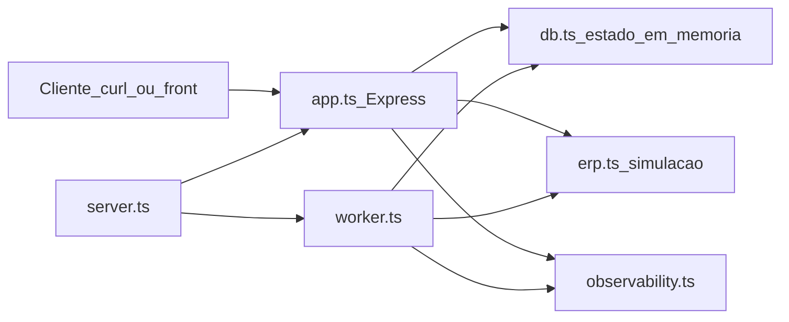
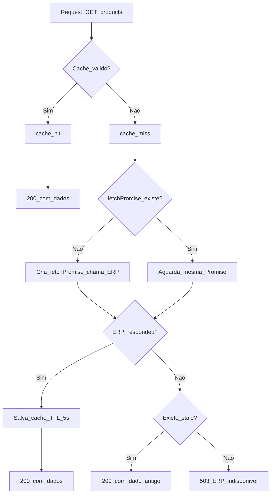
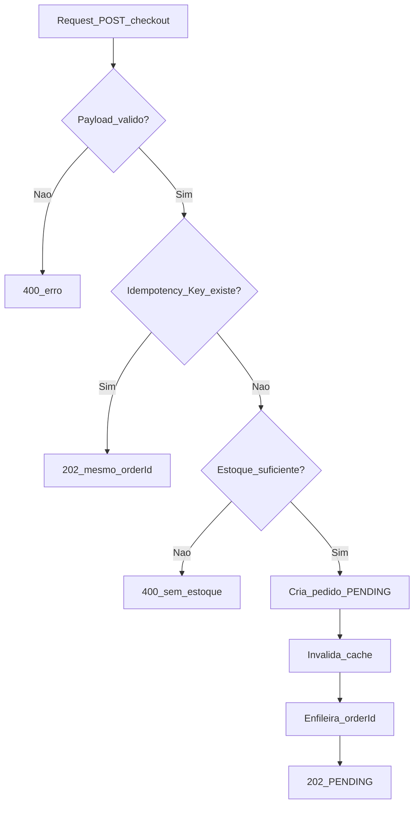

# CaseCellShop — Backend (Desafio Sênior)

Guia didático do backend da **CaseCellShop**, uma loja de capinhas de celular em hipercrescimento. Este documento foi escrito para que qualquer pessoa consiga entender o contexto do projeto, cada decisão técnica e o que cada arquivo em [`src/`](src/) faz — sem precisar já conhecer todos os termos de antemão.

---

## Sumário

- [O que é este projeto?](#o-que-é-este-projeto)
- [Glossário](#glossário)
- [Visão geral da arquitetura](#visão-geral-da-arquitetura)
- [Stack tecnológica](#stack-tecnológica)
- [Como rodar](#como-rodar)
- [Como testar](#como-testar)
- [Tour pelo código (`src/`)](#tour-pelo-código-src)
- [Fluxos passo a passo](#fluxos-passo-a-passo)
- [Decisões e trade-offs](#decisões-e-trade-offs)
- [Observabilidade](#observabilidade)
- [Operação avançada (SLO, alertas e runbook)](#operação-avançada-slo-alertas-e-runbook)
- [Referências rápidas](#referências-rápidas)

---

## O que é este projeto?

A CaseCellShop precisa de um **backend** (servidor que responde requisições HTTP) capaz de:

1. **Mostrar o catálogo** de produtos (`GET /products`) — com cache para não sobrecarregar o ERP.
2. **Aceitar pedidos** (`POST /checkout`) — debitando estoque de forma segura e processando o faturamento depois.
3. **Consultar o status** de um pedido (`GET /orders/{orderId}/status`).

### O que está no escopo

- Três rotas HTTP (API REST).
- **Cache** com TTL (tempo de vida) de 5 segundos.
- **Checkout assíncrono**: a API responde rápido; o faturamento no ERP roda em background.
- **Débito atômico de estoque**: evita vender mais unidades do que existem (overselling).
- **Idempotência**: repetir a mesma requisição de checkout não cria pedido duplicado.
- **Observabilidade simulada**: logs JSON, métricas e spans (rastros de tempo).
- Estado 100% **em memória** (`Map`, `Set`, `Array` do JavaScript).

### O que NÃO está no escopo

- Autenticação (login/senha).
- Pagamento real (cartão, PIX etc.).
- Front-end (tela do usuário).
- Deploy em nuvem.
- Integração real com ERP — o ERP é **simulado** em [`src/erp.ts`](src/erp.ts).

**Por que simular o ERP?** No cenário do desafio, o ERP é um sistema legado (antigo), crítico para a empresa e **não pode ser alterado**. Em vez de conectar a um sistema real, simulamos latência (~200–300 ms) e falhas aleatórias (~20%) para testar resiliência.

---

## Glossário

Leia esta seção antes de mergulhar no código. Cada termo aparece de novo nas explicações, mas aqui está a definição em linguagem simples.

| Termo | O que significa | Por que usamos aqui |
|---|---|---|
| **API / REST** | Interface que expõe funcionalidades via HTTP (GET, POST etc.). | O front-end ou `curl` consome nossas três rotas. |
| **Express** | Biblioteca Node.js para criar servidores HTTP. | Única dependência de runtime do projeto. |
| **Cache** | Cópia temporária de dados para responder mais rápido. | Evita chamar o ERP a cada visita na vitrine. |
| **TTL (Time To Live)** | Tempo até o cache expirar. Aqui: **5 segundos**. | Balanceia frescor dos dados vs. performance. |
| **Cache hit** | Dado encontrado no cache e ainda válido. | Resposta rápida, ERP não é chamado. |
| **Cache miss** | Cache vazio ou expirado; precisa buscar no ERP. | Dispara chamada ao ERP simulado. |
| **Cache stampede** | Várias requisições simultâneas chamam o ERP ao mesmo tempo quando o cache expira. | Prevenimos com `fetchPromise` compartilhada (single-flight). |
| **Stale cache** | Dado expirado mas ainda guardado na memória. | Plano B: se o ERP cair, servimos dado antigo em vez de erro. |
| **ERP** | Enterprise Resource Planning — sistema legado de estoque/faturamento. | Simulado em `erp.ts`; fonte "oficial" do catálogo. |
| **Checkout assíncrono** | API aceita o pedido e responde `202` sem esperar o ERP faturar. | Cliente não fica bloqueado enquanto o ERP demora ou falha. |
| **Worker** | Processo em background que roda a cada 2 segundos. | Processa a fila de pedidos pendentes. |
| **Fila (queue)** | Lista de IDs de pedidos aguardando faturamento. | Desacopla aceite do pedido (rápido) do faturamento (lento). |
| **DLQ (Dead Letter Queue)** | "Fila dos mortos" — pedidos que falharam 3 vezes no ERP. | Aguardam reconciliação quando o ERP voltar. |
| **Idempotência** | Executar a mesma operação várias vezes produz o mesmo resultado. | Header `Idempotency-Key` evita cobrar/debitar duas vezes. |
| **Débito atômico** | Checar estoque e subtrair em um único bloco, sem pausa no meio. | Impede duas compras simultâneas pegarem a mesma unidade. |
| **Observabilidade** | Logs, métricas e traces para entender o que aconteceu. | Debug e monitoramento em produção. |
| **Correlation ID** | ID que acompanha todo um fluxo (ex.: do checkout até o worker). | Header `X-Correlation-Id`; permite rastrear um pedido ponta a ponta. |
| **Request ID** | ID único de cada requisição HTTP individual. | Header `X-Request-Id`; diferencia duas chamadas no mesmo fluxo. |
| **Span** | Registro de quanto tempo uma operação levou. | Mede latência de `/products`, checkout, worker etc. |
| **HTTP 200** | Sucesso. | Catálogo retornado, status consultado. |
| **HTTP 202** | Aceito para processamento posterior. | Checkout aceito; faturamento virá depois. |
| **HTTP 400** | Erro do cliente (payload inválido, sem estoque). | Dados incorretos ou regra de negócio violada. |
| **HTTP 404** | Recurso não encontrado. | Pedido inexistente. |
| **HTTP 503** | Serviço indisponível. | ERP fora e sem cache stale para fallback. |
| **Event Loop** | Mecanismo do Node.js que processa código JavaScript em fila. | Garante que blocos síncronos não são interrompidos por `await`. |
| **Map / Set / Array** | Estruturas nativas do JavaScript para guardar dados. | Substituem banco de dados neste protótipo. |

---

## Visão geral da arquitetura

Tudo roda em **um único processo Node.js**. Quando você reinicia o servidor, **todo o estado some** (pedidos, cache, fila).



| Peça | Arquivo | Papel |
|---|---|---|
| Entrypoint | [`server.ts`](src/server.ts) | Liga o worker e a API na porta 3000. |
| Rotas HTTP | [`app.ts`](src/app.ts) | Define `/products`, `/checkout` e `/orders/.../status`. |
| Estado e regras | [`db.ts`](src/db.ts) | Estoque, cache, pedidos, fila, idempotência. |
| ERP simulado | [`erp.ts`](src/erp.ts) | Latência e falhas no catálogo e faturamento. |
| Worker | [`worker.ts`](src/worker.ts) | Processa fila, retry, DLQ e snapshots de métricas. |
| Observabilidade | [`observability.ts`](src/observability.ts) | Logs JSON, métricas, middleware de IDs. |
| Testes | [`test.ts`](src/test.ts) | Suíte automatizada com `node:test`. |

---

## Stack tecnológica

| Tecnologia | Papel | Por que escolhemos |
|---|---|---|
| **Node.js >= 18** | Runtime JavaScript no servidor. | Simples de rodar; bom para I/O HTTP. |
| **TypeScript** | JavaScript com tipos estáticos. | Reduz erros; autocomplete no editor. |
| **Express** | Framework HTTP. | Única dependência de runtime; suficiente para 3 rotas. |
| **`node:test` + `node:assert`** | Testes nativos (sem Jest). | Zero dependência extra de teste. |
| **`tsx`** | Executa TypeScript direto. | Dev experience: `npm run dev` sem compilar manualmente. |
| **`Map`, `Set`, `Array`** | Armazenamento em memória. | Restrição do desafio: sem Redis, Postgres, RabbitMQ etc. |

---

## Como rodar

### Pré-requisitos

- [Node.js](https://nodejs.org/) versão **18 ou superior**
- npm (vem junto com o Node)

Verifique:

```bash
node --version   # deve ser >= 18
npm --version
```

### Passo a passo

```bash
# 1. Instalar dependências
npm install

# 2. Subir API + worker
npm run dev
```

Você verá um log JSON parecido com:

```json
{"timestamp":"...","level":"INFO","msg":"API no ar","port":3000}
```

A API fica em **http://localhost:3000**. O **worker** (processamento de pedidos) roda no **mesmo processo**, acordando a cada ~2 segundos.

### Testando manualmente com curl

#### 1. Listar produtos

```bash
curl -s http://localhost:3000/products
```

Resposta esperada (exemplo):

```json
[{"id":"123","name":"Capinha A","price":29.9,"stock":10}]
```

- Na **primeira** chamada (ou após cache expirar): **cache miss** → busca no ERP (~200 ms).
- Na **segunda** chamada dentro de 5 s: **cache hit** → resposta instantânea.

#### 2. Fazer checkout

```bash
curl -s -X POST http://localhost:3000/checkout \
  -H 'Content-Type: application/json' \
  -H 'Idempotency-Key: demo-1' \
  -d '{"productId":"123","quantity":1}'
```

| Parte | Significado |
|---|---|
| `-X POST` | Método HTTP de criação/ação. |
| `Content-Type: application/json` | Corpo é JSON. |
| `Idempotency-Key: demo-1` | **Obrigatório.** Chave única por tentativa de compra. Repetir com a mesma chave não debita estoque de novo. |
| `productId` / `quantity` | Qual produto e quantas unidades. |

Resposta esperada:

```json
{"orderId":"ORD-...","status":"PENDING"}
```

Código HTTP: **202** (aceito, processamento em andamento).

#### 3. Consultar status do pedido

Substitua `<ORDER_ID>` pelo valor retornado no checkout:

```bash
curl -s http://localhost:3000/orders/<ORDER_ID>/status
```

Evolução típica do status:

| Status | Significado |
|---|---|
| `PENDING` | Pedido na fila; worker ainda não faturou no ERP. |
| `SUCCESS` | ERP confirmou o faturamento. |
| `FAILED` | ERP falhou 3 vezes; pedido foi para a DLQ. |

Tempo típico: **2–6 segundos** após o checkout (worker roda a cada 2 s + latência do ERP).

#### 4. Pedido inexistente

```bash
curl -s http://localhost:3000/orders/NAO-EXISTE/status
```

Resposta: **404** com `{"error":"Pedido não encontrado"}`.

#### 5. Headers de rastreamento (opcional)

```bash
curl -s http://localhost:3000/products \
  -H 'X-Correlation-Id: meu-fluxo-123' \
  -D -   # mostra headers de resposta
```

A resposta inclui `X-Correlation-Id` (mesmo valor ou gerado) e `X-Request-Id` (único por requisição).

---

## Como testar

### Comandos

```bash
# Suíte completa de testes (porta 3001)
npm test

# Verificação de tipos TypeScript (sem gerar JS)
npm run typecheck
```

### O que `npm test` faz

O arquivo [`src/test.ts`](src/test.ts) usa o runner nativo **`node:test`** (módulo built-in do Node.js, similar ao Jest mas sem instalar nada extra).

Antes de cada grupo de testes:

1. **Reseta o estado** (`resetState`) — estoque, cache, pedidos, fila, DLQ, métricas.
2. **Sobe um servidor de teste** na porta **3001** (para não conflitar com `npm run dev` na 3000).
3. **Inicia o worker** — mesmo código de produção.
4. **Controla o ERP** via `setErpFetchBehavior` / `setErpOrderBehavior` — força sucesso ou falha determinística (sem depender dos ~20% aleatórios).

### Tabela dos 11 cenários de teste

Os subtestes estão alinhados aos **3 problemas** do desafio (`docs/desafio.pdf`).

**Problema 01 — Performance da vitrine (cache)**

| Nome | O que prova |
|---|---|
| `cache: miss na 1ª chamada e hit na 2ª` | 1ª chamada incrementa `cache_miss`; 2ª incrementa `cache_hit`. |
| `cache: fallback stale quando ERP falha` | ERP falha, mas cache expirado existe → **200** com dado antigo. |
| `cache: ERP indisponível sem cache → 503` | ERP falha e cache vazio → **503**. |
| `cache: estoque reflete débito após checkout` | Estoque no `/products` reflete débito após invalidação de cache. |
| `cache: stampede — N misses concorrentes → 1 chamada ao ERP` | 10 requests paralelos no miss → **1** chamada ao ERP. |

**Problema 02 — Consistência de estoque**

| Nome | O que prova |
|---|---|
| `estoque: payload inválido → 400` | Checkout sem `Idempotency-Key` → **400**. |
| `estoque: concorrência bloqueia overselling` | 10 checkouts simultâneos, estoque 1 → só **1** retorna 202; estoque nunca fica negativo. |
| `estoque: idempotência — replay devolve mesmo orderId` | Mesma `Idempotency-Key` duas vezes → mesmo `orderId`, estoque debitado só 1x. |

**Problema 03 — Resiliência do checkout**

| Nome | O que prova |
|---|---|
| `checkout: worker evolui pedido para SUCCESS` | Pedido evolui de `PENDING` para `SUCCESS` com ERP forçado a sucesso. |
| `checkout: falha no ERP → FAILED e DLQ` | ERP sempre falha → status `FAILED`, pedido na DLQ. |
| `checkout: reconciliação automática da DLQ` | Pedido na DLQ é recuperado quando ERP volta; incrementa `checkout_reconciled`. |

### Dica para estagiários

Se um teste falhar intermitemente, verifique se você não tem `npm run dev` rodando ao mesmo tempo (portas diferentes, mas pode confundir ao debugar). Rode apenas `npm test` em um terminal limpo.

---

## Tour pelo código (`src/`)

Esta seção explica **cada arquivo** do diretório [`src/`](src/): o que é, o que guarda, as funções principais e por que foi feito assim.

---

### [`src/server.ts`](src/server.ts) — O interruptor

**7 linhas. Ponto de entrada da aplicação.**

```typescript
import { app } from './app';
import { logger } from './observability';
import { startWorker } from './worker';

startWorker();
app.listen(3000, () => logger.info('API no ar', { port: 3000 }));
```

| Linha | O que faz |
|---|---|
| `startWorker()` | Liga o processamento de pedidos em background **antes** da API. |
| `app.listen(3000)` | Abre a porta 3000 para receber requisições HTTP. |

**Analogia:** é o interruptor que liga a loja (API) e o funcionário de bastidor (worker) ao mesmo tempo.

---

### [`src/app.ts`](src/app.ts) — As rotas HTTP

**71 linhas. Monta o Express e define as 3 rotas.**

#### Configuração inicial

```typescript
app.use(express.json());           // interpreta corpo JSON
app.use(correlationMiddleware);    // injeta X-Correlation-Id e X-Request-Id
```

#### `GET /products`

- Chama `getProductsCatalog()` de [`db.ts`](src/db.ts).
- Se ERP indisponível e sem fallback: **503**.
- Caso contrário: **200** com array de produtos.

#### `POST /checkout`

1. Valida `productId`, `quantity` (inteiro >= 1) e header `Idempotency-Key`.
2. Chama `acceptCheckout()` — função **síncrona** (sem `await`).
3. Três resultados possíveis:
   - **replay** (idempotência): 202 com status atual do pedido.
   - **error** (produto inexistente / sem estoque): 400.
   - **accepted**: 202 com status `PENDING`.

**Por que checkout é síncrono?** Para garantir que checagem de estoque e débito acontecem num bloco contínuo, sem outra requisição "entrar no meio" via Event Loop.

#### `GET /orders/:orderId/status`

- Busca pedido em `ordersDb`.
- Encontrou: **200** com `{ id, status }`.
- Não encontrou: **404**.

---

### [`src/db.ts`](src/db.ts) — O coração do estado

**137 linhas. Guarda todos os dados e regras de negócio principais.**

#### Estruturas de dados

| Variável | Tipo | O que guarda |
|---|---|---|
| `productsDb` | `Map<string, Product>` | Estoque real — **fonte da verdade** local. |
| `cache` | `Map<string, { data, expiresAt }>` | Cópia do catálogo com TTL de 5 s. |
| `ordersDb` | `Map<string, Order>` | Pedidos e seus status. |
| `queue` | `string[]` | IDs de pedidos aguardando faturamento (FIFO). |
| `dlq` | `Map<string, { orderId, error }>` | Pedidos que falharam 3x no ERP. |
| `idempotencyMap` | `Map<string, string>` | Mapeia `Idempotency-Key` → `orderId`. |
| `fetchPromise` | `Promise \| null` | Promise compartilhada para anti-stampede. |

Produto seed inicial:

```typescript
{ id: '123', name: 'Capinha A', price: 29.9, stock: 10 }
```

#### `tryDebitStock(productId, quantity)`

Espelha este SQL:

```sql
UPDATE products SET stock = stock - ? WHERE id = ? AND stock >= ?
```

| Retorno | Significado |
|---|---|
| `'ok'` | Débito feito. |
| `'not_found'` | Produto não existe. |
| `'insufficient'` | Estoque insuficiente. |

Tudo acontece **sincronamente** — não há `await` entre checar e debitar.

#### `acceptCheckout(input)`

Fluxo síncrono (sem pausa):

```
1. Idempotency-Key já existe? → replay (mesmo orderId)
2. tryDebitStock → erro? → retorna mensagem
3. Cria pedido PENDING em ordersDb
4. Grava idempotencyMap
5. cache.delete('products')  ← invalida catálogo
6. queue.push(orderId)      ← enfileira para o worker
7. Retorna { kind: 'accepted', orderId }
```

#### `getProductsCatalog(ctx)`

Fluxo com cache-aside:

```
1. Cache válido (expiresAt > agora)? → cache_hit, retorna dados
2. cache_miss → precisa buscar no ERP
3. fetchPromise já existe? → aguarda a mesma Promise (anti-stampede)
4. Senão, cria fetchPromise = simulateErpFetch()
5. Sucesso → grava cache com expiresAt = agora + 5000ms
6. Falha + stale existe? → retorna dado antigo (fallback)
7. Falha + sem stale? → { ok: false, error: 'ERP indisponível' }
```

---

### [`src/erp.ts`](src/erp.ts) — Simulação do ERP legado

**62 linhas. Substitui um sistema externo real.**

#### Comportamento padrão

| Função | Latência | Taxa de falha |
|---|---|---|
| `simulateErpFetch()` | ~200 ms | ~20% aleatório |
| `simulateErpOrderCreation(orderId)` | ~300 ms | ~20% aleatório |

#### Hooks para testes

| Função | Uso |
|---|---|
| `setErpFetchBehavior('alwaysSucceed' \| 'alwaysFail')` | Força comportamento no catálogo. |
| `setErpOrderBehavior('alwaysSucceed' \| 'alwaysFail')` | Força comportamento no faturamento. |
| `getErpFetchCallCount()` | Conta quantas vezes o ERP foi chamado (teste de stampede). |
| `resetErpBehavior()` | Volta ao comportamento padrão. |

#### Idempotência no ERP

`processedOrders` é um `Set` — se o mesmo `orderId` chegar de novo (retry ou reconciliação), o ERP simula sucesso imediato sem reprocessar.

**Por que simular falhas?** Para testar retry, DLQ e fallback stale sem depender de um sistema externo instável.

---

### [`src/worker.ts`](src/worker.ts) — O funcionário de bastidor

**108 linhas. Processa pedidos fora do caminho crítico da API.**

#### Ciclo principal (a cada 2 segundos)

```
1. Guarda `processing` impede ciclos sobrepostos
2. Se queue.length > 0 → processa TODOS os itens da fila
3. Se queue vazia → tenta reconciliar 1 item da DLQ
```

#### `processOne(orderId)`

```
Para attempt = 1 até 3:
  1. Chama simulateErpOrderCreation(orderId)
  2. Sucesso → status SUCCESS, checkout_processed++, return
  3. Falha → espera 100 * 2^attempt ms (200ms, 400ms) e tenta de novo

Após 3 falhas:
  - status FAILED
  - dlq.set(orderId, ...)
  - checkout_failed++
```

**Importante:** se o pedido falha definitivamente, o **estoque NÃO é devolvido** automaticamente. O pedido fica na DLQ para reconciliação manual ou automática posterior.

#### `reconcileDlq()`

Quando a fila principal está vazia:

1. Pega 1 pedido da DLQ.
2. Tenta faturar no ERP novamente.
3. Sucesso → status SUCCESS, remove da DLQ, incrementa `checkout_reconciled`.

#### Snapshot de métricas (a cada 10 segundos)

Emite log `metrics_snapshot` com counters, gauges (`queue_depth`, `dlq_depth`, `stock_total`) e histogramas de latência.

#### `stopWorker()`

Para os intervals — usado no fim dos testes.

---

### [`src/observability.ts`](src/observability.ts) — Logs, métricas e rastreamento

**131 linhas. Tudo que ajuda a "ver" o sistema funcionando.**

#### Logger JSON

```typescript
logger.info('Checkout aceito', { correlationId, orderId, ... });
// Saída: {"timestamp":"...","level":"INFO","msg":"Checkout aceito",...}
```

Logs estruturados (JSON) são fáceis de filtrar em ferramentas como Datadog, Grafana Loki etc.

#### Middleware `correlationMiddleware`

Para cada requisição HTTP:

1. Lê `X-Correlation-Id` do header ou gera UUID novo.
2. Gera `X-Request-Id` único.
3. Devolve ambos nos headers de resposta.

| ID | Escopo | Analogia |
|---|---|---|
| `correlationId` | Todo o fluxo (checkout → worker) | Número do pedido na operação logística. |
| `requestId` | Uma chamada HTTP | Número da tentativa de atendimento no balcão. |

#### Métricas em memória

| Counter | Significado |
|---|---|
| `cache_hit` | Quantas vezes o cache serviu dados. |
| `cache_miss` | Quantas vezes precisou ir ao ERP. |
| `checkout_processed` | Pedidos faturados com sucesso (1ª vez). |
| `checkout_failed` | Pedidos que foram para DLQ. |
| `checkout_reconciled` | Pedidos recuperados da DLQ. |

Histogramas de latência: `get_products`, `post_checkout`, `worker_order`, `erp_fetch`, `erp_order`.

#### `span(name, durationMs, ctx)`

Registra quanto tempo uma operação levou e alimenta histogramas. Em produção, evoluiria para OpenTelemetry.

**Nota:** não há endpoint `/metrics`. Tudo é emitido via logs JSON (`span` e `metrics_snapshot`).

---

### [`src/test.ts`](src/test.ts) — Testes automatizados

**~280 linhas. Garante que as soluções dos 3 problemas do desafio funcionam.**

| Aspecto | Detalhe |
|---|---|
| Runner | `node:test` (nativo) |
| Asserções | `node:assert` |
| Porta | 3001 (isolada do dev na 3000) |
| Reset | `resetState()` limpa Maps, fila, métricas e ERP |
| Worker | `startWorker()` no início, `stopWorker()` no fim |
| Polling | `pollOrderStatus()` aguarda transições assíncronas do worker |

Os testes cobrem cache (hit/miss, stale, stampede, invalidação), concorrência/overselling, idempotência, worker, DLQ e reconciliação — alinhados aos 3 problemas do desafio.

---

## Fluxos passo a passo

### A. Listar produtos — `GET /products`



1. Cliente chama `GET /products`.
2. Se cache válido → retorna imediatamente (hit).
3. Se cache expirado/vazio → miss; uma única Promise busca no ERP.
4. ERP responde → salva cache por 5 s → retorna 200.
5. ERP falha com stale disponível → retorna 200 com dado antigo.
6. ERP falha sem stale → retorna 503.

---

### B. Fazer checkout — `POST /checkout`



1. Valida JSON e header `Idempotency-Key`.
2. Chave repetida → replay idempotente (202, sem novo débito).
3. `tryDebitStock` → falha → 400.
4. Cria pedido, invalida cache, enfileira → 202 `PENDING`.
5. Worker pega o pedido depois (fluxo C).

---

### C. Worker processa pedido

1. A cada 2 s, worker verifica a fila.
2. Retira pedido → tenta faturar no ERP (até 3x com backoff).
3. Sucesso → `SUCCESS`, incrementa `checkout_processed`.
4. Falha definitiva → `FAILED`, vai para DLQ, incrementa `checkout_failed`.
5. Quando fila vazia → tenta reconciliar 1 item da DLQ por ciclo.

---

## Decisões e trade-offs

Formato: **escolhemos X porque… o custo é…**

### Estado em memória (`Map`, `Set`, `Array`)

- **Por quê:** restrição do desafio — demonstrar fundamentos sem Redis, Postgres ou fila externa. Zero configuração para rodar.
- **Custo:** restart apaga tudo; não escala horizontalmente (duas instâncias teriam estoques diferentes).

### Cache-aside com TTL de 5 segundos

- **Por quê:** reduz latência da vitrine e carga no ERP legado.
- **Custo:** dados podem ter até 5 s de atraso. Mitigado por TTL curto, invalidação no checkout e fallback stale.

### Anti-stampede com `fetchPromise`

- **Por quê:** quando cache expira, 100 requests simultâneos não devem gerar 100 chamadas ao ERP.
- **Custo:** solução simples funciona em 1 processo; produção exigiria lock distribuído (Redis Redlock, etc.).

### Checkout assíncrono (202 + worker)

- **Por quê:** ERP é lento (~300 ms) e falha ~20%; cliente não deve esperar.
- **Custo:** consistência **eventual** — status começa como `PENDING`. Em produção, notificaria o cliente quando mudar.

### Estoque debitado na API, não no worker

- **Por quê:** evita overselling — só enfileira quem já "garantiu" estoque.
- **Custo:** se faturamento falha definitivamente (`FAILED`), estoque **não volta** automaticamente; pedido fica na DLQ para reconciliação.

### Invalidação total do cache (`cache.delete('products')`)

- **Por quê:** simplicidade — após checkout, catálogo inteiro é recarregado na próxima visita.
- **Custo:** próximo `/products` é miss (mais lento). Alternativa: invalidar só o produto alterado.

### Idempotência com `Map<chave, orderId>`

- **Por quê:** rede instável pode reenviar POST; mesma chave = mesmo pedido.
- **Custo:** funciona em 1 processo; multi-instância exigiria store compartilhado (Redis) com operação atômica insert-or-get.

### ERP simulado

- **Por quê:** ERP legado não pode ser alterado; simulação controla latência e falhas para testes reproduzíveis.
- **Custo:** comportamento real pode diferir (timeouts, formatos, autenticação).

---

## Observabilidade

### O que temos neste protótipo

| Recurso | Como funciona |
|---|---|
| Logs JSON | `console.log` / `console.error` estruturados. |
| Spans | Log `span` com `span_duration_ms` por operação. |
| Métricas | Counters e histogramas em memória; snapshot a cada 10 s. |
| Correlation | Header `X-Correlation-Id` propagado da API ao worker. |

### Exemplo de log de span

```json
{
  "timestamp": "2026-07-04T18:00:00.000Z",
  "level": "INFO",
  "msg": "span",
  "span": "get_products",
  "span_duration_ms": 3,
  "trace_type": "stub",
  "correlationId": "abc-123",
  "requestId": "def-456",
  "traceId": "abc-123",
  "cache": "hit"
}
```

### Exemplo de metrics_snapshot

```json
{
  "msg": "metrics_snapshot",
  "cache_hit": 42,
  "cache_miss": 5,
  "checkout_processed": 10,
  "checkout_failed": 1,
  "checkout_reconciled": 1,
  "queue_depth": 0,
  "dlq_depth": 0,
  "stock_total": 8,
  "erp_fetch_latency": { "count": 5, "avg_ms": 210, "p95_ms": 220 },
  "erp_order_latency": { "count": 10, "avg_ms": 305, "p95_ms": 310 }
}
```

### Métricas e o que significam na prática

| Métrica | Na prática |
|---|---|
| `cache_hit / (hit + miss)` | Quanto o cache alivia o ERP. Baixo = TTL curto demais ou muito checkout invalidando. |
| `queue_depth` | Pedidos esperando faturamento. Crescendo = worker ou ERP lento. |
| `dlq_depth` | Pedidos "presos" após falhas. Precisa atenção operacional. |
| `checkout_reconciled` | Recuperações da DLQ — separado de `checkout_processed` para SLI honesto. |
| `erp_fetch_latency` p95 | ERP lento no catálogo → vitrine degradada em cache miss. |
| `stock_total` | Soma de estoque; queda abrupta pode indicar problema. |

---

## Operação avançada (SLO, alertas e runbook)

Esta seção é referência para ambiente de produção. No protótipo local, os logs já simulam o que um dashboard consumiria.

### Painéis sugeridos

| Painel | Fonte | Objetivo |
|---|---|---|
| Cache hit ratio | `cache_hit / (cache_hit + cache_miss)` | Efetividade do cache |
| Latência `/products` | span `get_products` | Experiência da vitrine |
| Latência checkout/worker | spans `post_checkout`, `worker_order` | Tempo ponta a ponta |
| Profundidade da fila | `queue_depth` | Backlog de faturamento |
| Profundidade da DLQ | `dlq_depth` | Pedidos aguardando reconciliação |
| Throughput | `checkout_processed`, `checkout_reconciled` vs `checkout_failed` | Saúde do faturamento |
| Latência ERP fetch | `erp_fetch_latency` p95 | Lentidão no catálogo |
| Latência ERP faturamento | `erp_order_latency` p95 | Lentidão no worker |

### SLI / SLO

| Objetivo | SLI | SLO |
|---|---|---|
| Disponibilidade de `/products` | respostas 2xx / total | 99,9% mensal |
| Latência da vitrine (cache hit) | p95 de `GET /products` < 100 ms | 99% das janelas |
| Sucesso de checkout (eventual) | `(processed + reconciled) / (processed + failed)` | 99% mensal |

### Alertas sugeridos

| Alerta | Condição | Severidade |
|---|---|---|
| Cache ineficiente | Hit ratio < 80% por 10 min | Warning |
| Fila crescente | `queue_depth > 50` por 5 min | High |
| DLQ acumulada | `dlq_depth > 10` por 5 min | High |
| Taxa de falha alta | `checkout_failed` > 5% em 5 min | High |
| ERP lento (fetch) | p95 fetch > 1000 ms por 5 min | Warning |
| ERP lento (faturamento) | p95 order > 1000 ms por 5 min | Warning |
| Vitrine indisponível | 503 em `/products` > 1% em 5 min | High |

### Runbook — Fila crescente / DLQ alta

1. Confirmar `queue_depth` e `checkout_failed` acima do baseline.
2. Checar latência do ERP e logs `Pedido enviado para DLQ`.
3. Se ERP degradado: comunicar stakeholders; API continua aceitando pedidos com 202 enquanto houver estoque.
4. Inspecionar DLQ preservando `orderId`, erro e `correlationId`.
5. Após recuperação do ERP: reconciliar itens da DLQ de forma idempotente.
6. Validar normalização de `queue_depth` e crescimento de `checkout_processed`.
7. Registrar post-mortem e ajustar limiares/retry/capacidade.

---

## Referências rápidas

### Rotas da API

| Método | Rota | Sucesso | Erro |
|---|---|---|---|
| GET | `/products` | 200 `Product[]` | 503 |
| POST | `/checkout` | 202 `CheckoutAccepted` | 400 |
| GET | `/orders/{orderId}/status` | 200 `Order` | 404 |

Contrato completo: [`openapi.yaml`](openapi.yaml)

### Estrutura do repositório

```text
src/
  server.ts         Entrypoint: worker + API na porta 3000.
  app.ts            Rotas Express e validações HTTP.
  db.ts             Estado em memória, cache, checkout, catálogo.
  erp.ts            Simulação do ERP (latência e falhas).
  worker.ts         Fila, retry 3x, DLQ, reconciliação, métricas.
  observability.ts  Logger JSON, middleware, spans, snapshots.
  test.ts           Testes automatizados (node:test).

openapi.yaml        Contrato OpenAPI da API.
RESPOSTAS.md        Respostas conceituais do desafio.
PROMPTS.md          Registro de uso responsável de IA.
README.md           Este guia.
```

### Repositório

https://github.com/MateusHoffman/desafio-totvs

### Checklist final

- [ ] `npm run typecheck` passa sem erros.
- [ ] `npm test` passa com todos os cenários.
- [ ] `openapi.yaml` cobre as três rotas com schemas de sucesso e erro.
- [ ] `RESPOSTAS.md`, `README.md`, `openapi.yaml` e `PROMPTS.md` presentes.
- [ ] Repositório público em https://github.com/MateusHoffman/desafio-totvs.
