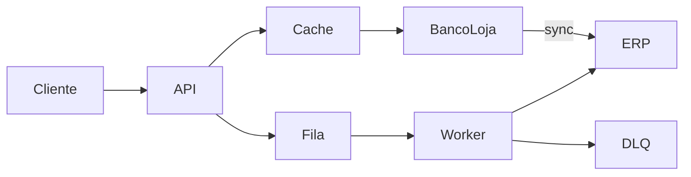

# RESPOSTAS — Desafio CaseCellShop

Respostas conceituais da Parte 1.A do desafio. Linguagem direta — cada seção começa pela resposta e depois explica o porquê.

---

## Glossário rápido

| Termo | O que é |
|---|---|
| **ERP** | Sistema legado da empresa (estoque, faturamento). Não pode ser alterado neste case. |
| **Cache** | Cópia temporária dos dados para responder mais rápido sem chamar o ERP toda vez. |
| **TTL** | Tempo de vida do cache. Depois expira e precisa buscar de novo. Aqui: 5 segundos. |
| **Overselling** | Vender mais unidades do que existem em estoque. |
| **Idempotência** | Repetir a mesma requisição não cria efeito duplicado (mesmo pedido, mesmo débito). |
| **DLQ** | Dead Letter Queue — fila de pedidos que falharam 3 vezes e aguardam reconciliação. |
| **Worker** | Processo em background que fatura pedidos na fila, sem travar o cliente. |
| **Cache stampede** | Várias requisições batem no ERP ao mesmo tempo quando o cache expira. |
| **Stale cache** | Dado expirado mas ainda guardado — usado como plano B se o ERP cair. |
| **Correlation ID** | ID que acompanha um fluxo inteiro (checkout → worker). Header `X-Correlation-Id`. |

---

## Pergunta 1 — Diagnóstico, trade-offs e arquitetura alvo

### Problema 1 — Vitrine lenta

**Resumo:** a loja chama o ERP a cada visita na vitrine. O ERP é lento e crítico — isso não escala.

**Causa raiz:** leitura de alta frequência (catálogo) acoplada de forma síncrona a um monolito legado. O sintoma é lentidão; a causa é não ter camada intermediária entre vitrine e ERP.

**Impacto:**

- **Cliente:** página lenta, timeout, abandono antes do checkout.
- **Negócio:** menos conversão, menos receita, marca percebida como lenta.
- **Operação:** ERP sobrecarregado por leituras de vitrine, ameaçando faturamento e financeiro.

**Caminhos de solução:**

| Opção | Prós | Contras |
|---|---|---|
| Cache-aside com TTL | Barato, simples, latência muito baixa em hit | Dado pode ficar alguns segundos desatualizado |
| Banco próprio da loja (read-model) | Latência previsível, melhor consistência de catálogo | Mais infra e sincronização com ERP |
| CDN/cache de borda | Excelente latência global | Invalidação difícil para preço/estoque |

**No protótipo:** cache-aside em memória, TTL 5s, anti-stampede com `fetchPromise` compartilhada e fallback stale se o ERP falhar.

**Em produção:** banco próprio da loja sincronizado do ERP + cache distribuído (Redis) na frente.

---

### Problema 2 — Overselling (vender sem estoque)

**Resumo:** duas compras simultâneas podem passar na validação de estoque — detalhes na Pergunta 4.

**Causa raiz:** não existe operação atômica entre "li o estoque" e "debito o estoque". Há uma janela de corrida sob concorrência.

**Impacto:**

- **Cliente:** compra confirmada e cancelada depois.
- **Negócio:** estornos, chargebacks, atendimento reativo.
- **Operação:** reconciliação manual entre loja, estoque e ERP.

**Caminhos de solução:**

| Opção | Prós | Contras |
|---|---|---|
| Update atômico condicional | Simples, forte consistência por operação | Exige suporte do banco (`WHERE stock >= qty`) |
| Reserva de estoque com expiração | Bom para jornadas longas (carrinho, pagamento) | Mais complexo de operar |
| Lock pessimista ou distribuído | Forte durante o lock | Lento sob contenção, risco de deadlock |

**No protótipo:** `tryDebitStock` em bloco síncrono — checa e debita sem `await` no meio (`src/db.ts`).

**Em produção:** `UPDATE products SET stock = stock - ? WHERE id = ? AND stock >= ?` no banco próprio da loja.

---

### Problema 3 — Checkout lento e instável

**Resumo:** o cliente espera o ERP faturar antes de receber resposta. ERP é lento (~300 ms) e falha ~20%.

**Causa raiz:** checkout síncrono acoplado ao faturamento no ERP legado. O caminho crítico da compra depende de um sistema que deveria estar fora dele.

**Impacto:**

- **Cliente:** espera longa, timeout, dúvida se o pedido foi aceito.
- **Negócio:** abandono no checkout — o momento mais valioso do funil.
- **Operação:** retries manuais, chamados sem rastreio, reconciliação difícil.

**Caminhos de solução:**

| Opção | Prós | Contras |
|---|---|---|
| Fila + worker + retry + DLQ | Cliente responde rápido (`202`) | Faturamento é eventual, precisa reconciliar |
| Timeout + retry inline | Simples de implementar | Cliente ainda espera; frágil em falha |
| Outbox + broker | Publicação confiável pedido → fila | Infra e complexidade altas |

**No protótipo:** `POST /checkout` debita estoque, grava pedido `PENDING`, enfileira e retorna `202` sem esperar o ERP. Worker tenta 3x; falha definitiva vai para DLQ.

**Em produção:** fila gerenciada (SQS/RabbitMQ), workers escaláveis, transactional outbox para garantir publicação.

---

### Arquitetura alvo — 30 a 90 dias

Manter o ERP como referência, **sem alterá-lo**. Criar camada própria da loja para leitura, checkout e resiliência.

**0–30 dias**

- Cache distribuído (Redis) com TTL, jitter e single-flight.
- Fila gerenciada + workers com retry/backoff e DLQ.
- Logs, métricas e traces reais (OpenTelemetry/Datadog).

**30–60 dias**

- Banco próprio da loja como read-model de catálogo e estoque.
- Sincronização incremental ou CDC a partir do ERP (somente leitura).
- Cache protege o read-model, não o ERP diretamente.

**60–90 dias**

- Reconciliação automática entre DLQ, pedidos `FAILED` e estado no ERP.
- Workers horizontais; idempotência persistente (tabela, não `Map` em memória).
- Revisão de SLOs e runbooks com dados reais de produção.

---

## Pergunta 2 — Cache, invalidação e performance da vitrine

### Onde colocar cache (3 camadas)

| Camada | Papel |
|---|---|
| **Navegador / CDN** | Assets e respostas públicas pouco voláteis. Reduz latência global. |
| **Cache de aplicação** | O que o protótipo implementa: `Map` em memória, TTL 5s, cache-aside. |
| **Cache distribuído** | Evolução para múltiplas instâncias (Redis). Mesmas regras + lock leve anti-stampede. |

### Como funciona no protótipo

**Cache-aside** — fluxo do `GET /products`:

1. API olha o cache.
2. **Hit** (dado válido): responde na hora, ERP não é chamado.
3. **Miss** (vazio ou expirado): busca no ERP, grava no cache, responde.

**TTL (5 segundos):** equilibra frescor vs. performance. Preço e estoque mudam mais — TTL curto + invalidação ativa no checkout.

**Invalidação ativa:** após checkout bem-sucedido, `cache.delete('products')`. Próximo `GET /products` busca estoque atualizado.

**Anti-stampede:** quando o cache expira, a 1ª requisição cria `fetchPromise`; as demais esperam a mesma busca. Evita N chamadas simultâneas ao ERP. `fetchPromise` é limpa em sucesso **e** falha.

**Fallback stale:** se o ERP falha num miss e existe dado expirado no cache, serve o dado antigo. Sem nada no cache → `503`.

### Refresh-ahead (alternativa não usada)

Atualiza o cache em background **antes** do TTL expirar. Cliente sempre recebe cache quente.

- **Por que não usei:** mais complexo (job de refresh, controle de concorrência).
- **Quando usaria:** catálogo com altíssima leitura e p95 instável. Combinaria com invalidação por evento de estoque.

### Métricas

**Provar que o cache melhorou performance:**

- Hit ratio: `cache_hit / (cache_hit + cache_miss)` — quanto menos miss, menos carga no ERP.
- p95 de `GET /products` separando hit vs. miss (`span_duration_ms`).
- p95 de `erp_fetch_latency_ms` — latência do fetch de catálogo no ERP.

**Garantir que não entregamos dado velho/incorreto:**

- Idade máxima do cache vs. TTL configurado.
- Taxa de fallback stale por janela de tempo.
- Alerta se `503` ou fallback stale crescerem (ERP degradado ou TTL mal calibrado).

---

## Pergunta 3 — Observabilidade

### Logs estruturados

JSON em uma linha, indexável por Datadog ou equivalente.

**Campos obrigatórios:**

| Campo | Por quê |
|---|---|
| `timestamp` | Ordenar e filtrar eventos no tempo |
| `level` | Separar INFO, WARN, ERROR |
| `correlationId` | Rastrear um fluxo inteiro (checkout → worker). Vem de `X-Correlation-Id` |
| `requestId` | UUID único por requisição HTTP — diferencia retries no mesmo fluxo |
| `traceId` | No protótipo, igual ao `correlationId` |
| `orderId` | Quando existe — ligar log ao pedido |

**Eventos que eu logaria:**

- Cache hit/miss em `GET /products`
- Checkout aceito (`orderId`, `productId`, `correlationId`)
- Consulta de status
- Pedido faturado no ERP
- Pedido na DLQ e DLQ reconciliada
- `metrics_snapshot` periódico (a cada 10s no worker)

### Métricas

**Counters** (só sobem):

- `cache_hit` / `cache_miss` — eficácia do cache
- `checkout_processed` — faturados com sucesso na 1ª passagem do worker
- `checkout_failed` — enviados para DLQ após 3 tentativas
- `checkout_reconciled` — recuperados da DLQ (counter separado para não contar em dobro)

**Gauges** (valor atual):

- `queue_depth` — pedidos aguardando faturamento
- `dlq_depth` — pedidos aguardando reconciliação
- `stock_total` — estoque agregado

**Histograms:**

- `erp_fetch_latency_ms` — latência do fetch de catálogo
- `erp_order_latency_ms` — latência do faturamento
- `latencies.*` — duração por rota (`get_products`, `post_checkout`, `worker_order`, `get_order_status`) com `count`, `avg_ms`, `p95_ms`

**O que cada uma detecta cedo:**

- `queue_depth` subindo → ERP ou worker degradado
- `checkout_failed` alto → DLQ acumulando
- `cache_miss` alto → TTL ou invalidação inadequados
- p95 do ERP subindo → lentidão iminente na vitrine (miss) ou no faturamento

### Traces distribuídos

No protótipo são **stubs** (logs com `span_duration_ms` e `trace_type: "stub"`). Em produção: OpenTelemetry com `traceparent` no HTTP e na mensagem da fila.

**`GET /products`:**

1. Request HTTP → middleware (correlationId, requestId)
2. Verifica cache → hit ou miss
3. Em miss: fetch no ERP
4. Resposta (span `get_products`)

**`POST /checkout` (assíncrono):**

1. Request HTTP → `acceptCheckout` síncrono
2. Débito atômico de estoque
3. Grava pedido + enfileira (span `post_checkout`)
4. Worker (assíncrono): dequeue → tenta ERP até 3x → `SUCCESS` ou `FAILED`/DLQ
5. Span `worker_order` com `parentSpan: post_checkout` ligado ao `correlationId` original

### SLI/SLO, alertas, dashboard e runbook

**SLI/SLO:**

- [ ] Disponibilidade `GET /products`: SLI = 2xx / total → SLO **99,9%** mensal
- [ ] Latência vitrine (hit): SLI = p95 < 100ms → SLO **99%** das janelas
- [ ] Sucesso checkout eventual: SLI = `(processed + reconciled) / (processed + failed)` → SLO **≥ 99%**

**Alertas:**

- [ ] Hit ratio < 80% por 10 min
- [ ] `queue_depth` > 50 por 5 min
- [ ] `checkout_failed` > 5% em 5 min
- [ ] p95 ERP > 1s por 5 min
- [ ] Taxa de `503` em `/products` > 1% em 5 min

**Dashboard:** hit ratio, p95 `/products`, profundidade de fila, taxa sucesso/falha checkout, p95 ERP, estoque agregado.

**Runbook — fila/DLQ alta:**

1. Confirmar `queue_depth` e `checkout_failed` no dashboard
2. Checar latência e erros do ERP
3. Comunicar degradação ao time
4. Preservar itens na DLQ (não descartar)
5. Após recuperação: reprocessar idempotentemente e reconciliar com ERP
6. Post-mortem e ajuste de limites/retry

---

## Pergunta 4 — Concorrência, estoque e idempotência

### Por que "if stock > 0" não basta

**Resumo:** duas requisições podem ler o mesmo estoque antes de qualquer uma debitar — e as duas passam.

**Exemplo:** produto com 1 unidade. Compra A e B chegam juntas. Ambas leem `stock = 1`. Ambas aprovam. Resultado: vendemos 2, temos 1.

**Solução:** checar e debitar numa única operação atômica.

### Comparar estratégias

| Estratégia | Quando usar | Contras |
|---|---|---|
| **Update atômico condicional** | Primeira escolha para débito de estoque | Precisa de banco que suporte |
| **Pessimistic lock** | Operações que bloqueiam múltiplos registros | Lento sob contenção, deadlocks |
| **Reserva de estoque** | Jornadas longas (carrinho, pagamento externo) | Complexidade de expiração |
| **Distributed lock** | Último recurso, sem operação atômica no store | Sensível a falhas de rede |

**No protótipo:** `tryDebitStock` espelha `UPDATE ... WHERE stock >= quantity`. Bloco síncrono em `acceptCheckout`, sem `await` entre checagem e débito.

### Idempotência

Header `Idempotency-Key` no checkout.

**Como funciona:**

1. 1ª requisição com a chave → debita estoque, cria pedido, registra chave → `Map<chave, orderId>`
2. Reenvio com mesma chave → `202` com **mesmo** `orderId` e **status atual**, sem novo débito
3. Chave só é gravada **após** débito bem-sucedido — rejeição por estoque insuficiente não "queima" a chave

**Limitação do protótipo:** `Map` em memória funciona em processo único. Multi-instância exige store compartilhado (Redis/DB) com insert-or-get atômico.

**No worker:** reprocessar DLQ ou repetir chamada ao ERP não pode faturar duas vezes — `simulateErpOrderCreation` deduplica por `orderId`.

### Como testei overselling

1. Criar produto com estoque = 1
2. Disparar 10 `POST /checkout` simultâneos (`Promise.all`)
3. Cada um com `Idempotency-Key` **diferente** (testa concorrência de estoque, não deduplicação)
4. Resultado esperado: **1** resposta `202`, **9** respostas `400`, estoque final = `0` (nunca negativo)

---

## Pergunta 5 — Mensageria, resiliência, contrato e IA

### Ordem: gravar pedido → enfileirar

**Resposta:** gravar o pedido **antes** de publicar na fila.

**Por quê:** se enfileirar antes de gravar, a mensagem aponta para um pedido que não existe → **pedido fantasma**.

No protótipo: `ordersDb.set(...)` vem antes de `queue.push(orderId)` em `src/db.ts`.

### Pedido fantasma vs. mensagem fantasma

| Risco | O que é | Como evitar |
|---|---|---|
| **Pedido fantasma** | Mensagem na fila sem pedido gravado | Gravar pedido antes de enfileirar |
| **Mensagem fantasma** | Pedido gravado, mas publicação na fila falhou | Em produção: **transactional outbox** (pedido + evento na mesma transação do banco) |

### Retry, DLQ e reconciliação

1. Worker pega pedido da fila
2. Tenta faturar no ERP (até **3 tentativas** com backoff)
3. Sucesso → status `SUCCESS`, incrementa `checkout_processed`
4. Falha definitiva → status `FAILED`, vai para DLQ, incrementa `checkout_failed`
5. Fila ociosa → reconcilia **1 item da DLQ por ciclo**, idempotentemente; incrementa `checkout_reconciled` (não `checkout_processed`)

A DLQ não é lixeira — é fila de reconciliação para quando o ERP voltar.

### OpenAPI

Contrato em `openapi.yaml` documenta as 3 rotas com schemas de sucesso e erro:

- `GET /products` → `200` / `503`
- `POST /checkout` → `202` / `400` (header `Idempotency-Key` obrigatório)
- `GET /orders/{orderId}/status` → `200` / `404`

Reduz ambiguidade entre cliente, backend e operação.

### O que os testes provam

Suíte em [`src/test.ts`](src/test.ts) com **11 subtestes**, alinhados aos 3 problemas do desafio:

**Problema 01 — Vitrine:** cache hit/miss, fallback stale, ERP indisponível sem cache (`503`), invalidação de estoque após checkout, anti-stampede (1 chamada ao ERP sob concorrência).

**Problema 02 — Estoque:** payload inválido → `400`; 10 checkouts simultâneos com estoque 1 → 1 sucesso, estoque não negativo; replay idempotente → mesmo `orderId`, débito único.

**Problema 03 — Checkout:** worker evolui pedido para `SUCCESS`; falha definitiva no ERP → `FAILED` + DLQ; reconciliação automática quando ERP volta (`checkout_reconciled`).

### Uso de IA

IA usada para decompor tarefas, revisar trade-offs e acelerar rascunhos. Todas as sugestões foram revisadas criticamente.

Registro completo dos prompts em [`PROMPTS.md`](PROMPTS.md).

---

## Repositório (Parte 1.B)

https://github.com/MateusHoffman/desafio-totvs
